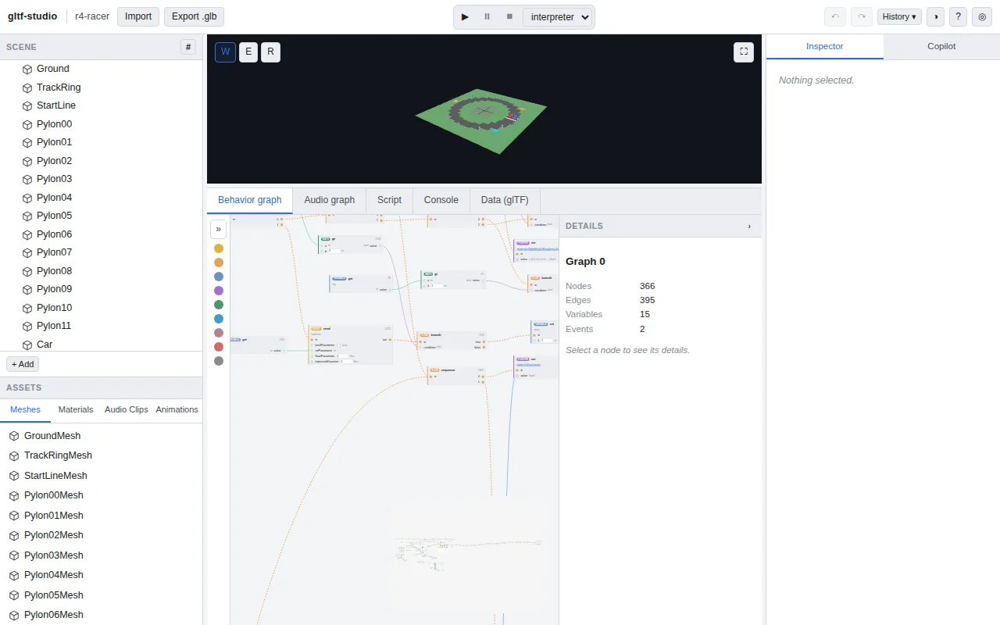
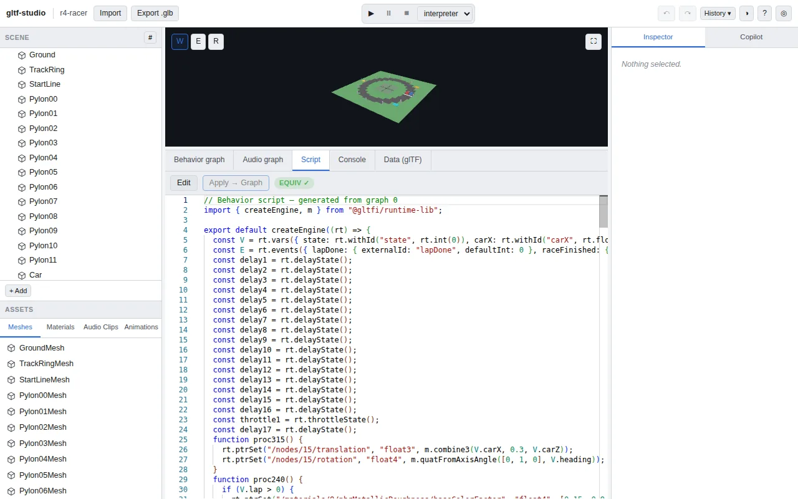

# gltf-studio



**Live:** https://rudybear.github.io/gltf-studio/ — a landing page with two real screenshots and a
**Launch editor** link (the editor itself lives at `/app/`; see `.github/workflows/deploy.yml`).
No install needed.

## What it is

`gltf-studio` is a browser editor where the input and the output are both plain glTF — yet the
file in between can carry a full scene, spatial audio, and a complete game's worth of logic. Wire
up **KHR_interactivity** behavior graphs, and the exact same behavior is also readable, editable
TypeScript-flavored code: graphs and scripts are two views of one document, not two things that
can drift apart. An **EQUIV** badge is the editor proving that on every edit, not just claiming it.
The point isn't a new engine or a new file format — it's convergence: an artist wiring nodes and a
developer editing code are shaping the same behavior, in the same file, at the same time.

**This is an early, honest checkpoint** — see [Roadmap](#roadmap) below for what's still ahead.

## Screenshots

| Behavior graph | Script (decompiled, EQUIV) |
| --- | --- |
|  |  |

Both are the real app, driven the same way `e2e/racer.spec.ts` drives it, against the committed
`samples/r4-racer.glb` — a complete top-down racing game (steering, lap-checkpoint gating with
anti-cheat, boost, an AI rival, a 12-step finish sequence) in one ~100KB `.glb`, no separate engine
project.

## Features

- **Graphs ⇄ scripts, one document** — every `KHR_interactivity` graph emits to real code and
  parses back; editing either side re-derives the other, and the EQUIV/DIVERGED badge
  (`packages/script-panel`) tells you which state you're in, always against the real graph.
- **Usage mapping** — select any scene node or graph node and see, both ways, everywhere it's
  referenced (`Used in behavior`, `→ Graph`/`→ Script` jumps with a visible, persistent
  highlight) — the two representations stay navigable as one thing, not two.
- **Real scene + audio authoring** — a proper viewport (gizmos, selection, hover, undo/redo) over
  `KHR_lights_punctual`, `KHR_audio_emitter`/`_environment`, and a `KHR_audio_graph` patcher.
- **Play in-editor, two engines** — a reference interpreter and a graph-to-JS compiled engine, side
  by side for parity, driven from the same document, no separate build step.
- **Copilot** — a right-panel assistant that proposes graph/scene edits from a prompt, previewable
  and rejectable before anything commits. Defaults to a small deterministic mock
  (`packages/agent-mock`) with a handful of prompt templates; Settings → **Local model** points it
  at any OpenAI-compatible tool-calling endpoint on your own machine instead (Ollama, LM Studio —
  `packages/agent-llm`, [docs/adr/0005](docs/adr/0005-local-openai-compatible-llm-provider.md)). No
  hosted/cloud AI, no API keys sent anywhere but the endpoint you configure.

  **Recommended model:** validated live against several installed Ollama models
  (`scripts/ai-smoke.mjs`'s prompt matrix — spin/move/play-sound/add-cubes/multi-step/out-of-scope/
  ambiguous). `gemma4:26b` is the suggested default: it matched a much larger 125B-parameter
  model's accept-when-answerable / refuse-when-not pattern on every prompt tested, while responding
  in well under a second once warm versus 14-40 seconds for the larger model's own reasoning
  preamble. This is only a suggestion — the settings dialog's model field is free text, and any
  tool-calling-capable model works. Not every local model qualifies: e.g. `deepseek-r1:32b` (a
  reasoning-focused model, no native tool-calling support in this Ollama build) is rejected by the
  endpoint outright with `does not support tools`.

  **CORS for a local model:** most local servers block cross-origin requests by default, so
  Settings → **Test connection** may report "CORS-blocked" the first time. For Ollama, set
  `OLLAMA_ORIGINS` to include every page origin you'll drive it from before restarting it, e.g.:
  ```sh
  OLLAMA_ORIGINS="http://localhost:5173,http://localhost:4173,https://rudybear.github.io" ollama serve
  ```
  (`5173`/`4173` cover `pnpm dev`/`pnpm build && pnpm preview` locally; the `https://` origin covers
  driving your own machine's model from the hosted Pages demo — a `https://` page fetching
  `http://localhost` is allowed by the browser's own "localhost is a secure context" exception, so
  CORS is genuinely the only thing to configure here, not mixed-content blocking). For LM Studio,
  enable CORS in the server settings (Developer tab → Server Settings → "Enable CORS"). Some Ollama
  installs already default to a permissive `Access-Control-Allow-Origin: *` — Test connection tells
  you definitively whether yours does, rather than guessing from the version/defaults alone.
- **Byte-preserving export** — write the current document back out to `.glb`, preserving container
  bytes wherever nothing changed, importable by any conformant `KHR_interactivity` runtime.

## Quickstart

- **Use it hosted**: https://rudybear.github.io/gltf-studio/ → **Launch editor** → **R4 Racer** (or
  **Empty scene**) on the starter gallery.
- **Run it locally**:
  ```sh
  pnpm install
  pnpm dev            # http://localhost:5173/app/, hot-reloading
  ```
  or build + preview the production bundle the same way CI/Pages does:
  ```sh
  pnpm build && pnpm --filter @gltf-studio/app run preview
  ```
- **Regenerate the sample asset** (after changing `scripts/make-sample.mjs`): `pnpm sample` —
  writes and verifies `samples/playground.glb` (structural + headless-interpreter checks; fails
  loudly rather than writing a broken asset).

## Architecture

A Vite + React + zustand app shell (`packages/app`) sits on top of an immutable, patch-based
document core (`packages/editor-core`) that every editing surface — the viewport
(`packages/engine-three`), the behavior-graph and audio-graph canvases
(`packages/graph-canvas`/`audio-canvas`/`audio-graph`), the script tab (`packages/script-panel`),
usage mapping (`packages/usage-index`), play mode (`packages/play`), and Copilot
(`packages/agent-mock`) — reads from and writes back to through the same
`Command`/`HistoryStack` mechanism. Every persistence/rendering/play/audio concern is routed
through an interface (`StorageProvider`, `RenderHost`, `PlayController`, `AudioHost`/
`AudioGraphHost`, all in `packages/engine-api`) so a hosted backend and additional engines can
arrive later without reworking the editor itself. Underneath all of it, the vendored `@gltfi/*`
packages (`docs/adr/0003-vendored-gltfi-tarballs.md`) provide the real `KHR_interactivity`
parse/verify/interpret/compile/emit pipeline — the same open-source stack behind the sibling
`gltf-interactivity` repos below. See `specs/README.md` for the requirement set, `docs/adr/` for
the standing architecture decisions, and `/STATUS.md` (generated — see below) for the
requirement → citing-test traceability matrix.

## Development model

The repo follows a spec-gated, "living project state" model, briefly: requirements
(`/specs/*.md`), UX (`/docs/ux/`), and architecture decisions (`/docs/adr/`) change in the same PR
as the code they govern; `/STATUS.md` is generated (never hand-edited, regenerate with
`pnpm status`); and CI-enforced drift checks (`scripts/check-drift.mjs`) fail the build if a test
cites a retired/unknown requirement or code changes under a spec's ownership without an
accompanying spec diff. Before pushing, run `pnpm check:ci` (drift `--simulate-pr`, `gen-status
--check`, tsconfig-strict check, lint, drift self-test, build, unit tests — `pnpm install` also
wires a fast `pre-push` hook automatically); `pnpm test:browser` and `pnpm e2e` need a real browser
and only run in CI or on demand.

## Debugging

- **`tsconfig` layout**: `tsconfig.base.json` is the single source of truth for compiler options
  (`strict: true` included) — every package's `tsconfig.json` (`packages/*/tsconfig.json`)
  `extends` it, as does the root `tsconfig.json`. The root config is otherwise solution-style
  (`files: []` + `references` only, no files of its own — `pnpm build`'s `tsc -b` walks those
  references to build every package) — its `extends` exists so that files with no package of their
  own (`e2e/**`, `playwright.config.ts`, `vitest.config.ts`, `scripts/**`) still resolve `strict`
  and the rest of the base options when an editor or a bare `tsc` walks up to the nearest
  `tsconfig.json`. `pnpm check:strict` (wired into `pnpm check:ci` and CI) asserts every
  `tsconfig.json` in the repo resolves `strict: true` in its effective, post-`extends` options —
  see `scripts/check-tsconfig-strict.mjs`.
- **Source maps**: the built app (`packages/app/vite.config.ts`, `build.sourcemap: true`) ships
  full external `.map` files for every emitted chunk — the main bundle, the Monaco/parse/layout
  worker chunks, and `gltfi-runtime-lib.mjs` (bundled separately by
  `packages/app/scripts/bundle-runtime-lib.mjs`, also `sourcemap: true`). Several packages
  (`editor-core`, `graph-canvas`, `storage`, …) are consumed as their own pre-compiled
  `tsc -b` output (`dist/*.js` + `dist/*.js.map`, from `tsconfig.base.json`'s `sourceMap: true`)
  rather than raw `.ts` — `rollup-plugin-sourcemaps2` (wired into `vite.config.ts`'s
  `build.rollupOptions.plugins`) chains those existing maps into the app bundle's own map so
  devtools resolves all the way back to the real `.ts` sources, not just the compiled JS. Open the
  built/deployed app, open devtools, and any first-party file should show real, multi-line
  TypeScript, steppable — not one-lined/minified.

## Roadmap

This is an early draft, not a finished product. Ahead:

- Deeper scene authoring (more primitive/light/camera types, materials beyond PBR basics).
- Richer audio authoring (more `KHR_audio_graph` node kinds, effects).
- Persistence/sharing beyond local browser storage and the local filesystem.

## Ecosystem

Built on the open-source KHR_interactivity stack:
[gltf-interactivity](https://github.com/rudybear/gltf-interactivity) (the core
parse/verify/interpret/compile/emit toolchain),
[gltf-interactivity-three](https://github.com/rudybear/gltf-interactivity-three) (a three.js
runtime), [gltf-interactivity-game](https://github.com/rudybear/gltf-interactivity-game) (the R4
Racer game this editor's sample was built from), and
[gltf-interactivity-vscode](https://github.com/rudybear/gltf-interactivity-vscode) (editor
tooling outside the browser).

## License

MIT — see [`LICENSE`](LICENSE).
